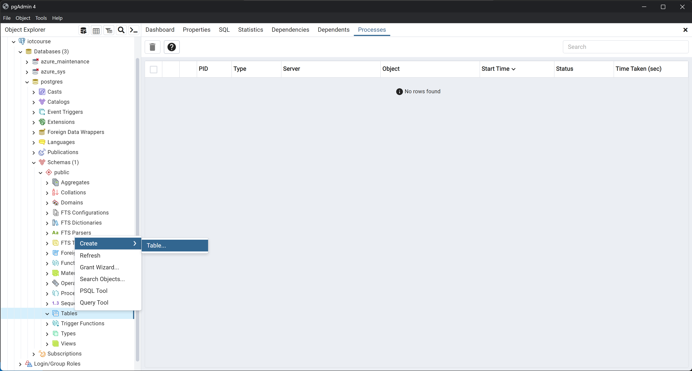

# Setting up the cloud and connecting a IoT device

Some general information:
- Resource groups: grouping of multiple resources for organization.
- Most selections can be left on the default.

## IoT Hub

Create an IoT hub on Azure following this tutorial and register a demo device (the "Update the IoT hub" can be skipped): https://learn.microsoft.com/en-us/azure/iot-hub/iot-hub-create-through-portal

Use the IoT Hub free tier.

## Create as sample device on your laptop

Create a simulated device running on your laptop similar to this example and run it. https://github.com/Azure/azure-iot-sdk-python/blob/main/samples/async-hub-scenarios/send_message.py
You just have to insert your connection string found on device properties found on the IoT Hub.

Using the IoT hub VSCode extension you can start monitoring the build in event endpoint and check that your messages are received by the IoT Hub. You have to make sure you are logged in to Azure in VSCode. The extension page shows how to monitor the endpoint: https://marketplace.visualstudio.com/items?itemName=vsciot-vscode.azure-iot-toolkit

## Connect the RevPi as a IoT device to the IoT Hub

Using the setup from yesterday connect the RevPi to the IoT Hub and send messages with all the values read from the PLC. Additionally record the time of measuring.
For example you can read the values of the plc every second and send the data to the IoT hub every 20 seconds (this avoids hitting the daily message limit of 8000 of the free tier). Make sure you are sending the data in a format that can easily be used for further processing like json.

Again check that the messages are received by the IoT Hub.

## Create a Database

We are now receiving message on the IoT Hub and they are only stored temporarily until they are processed for up to 24 hours, so to store them permanently we need some kind of storage.
We are going to utilize a PostgreSQL database to store the recorded values. (We skip the timescaleDB extension in this example for simplicity, you are free to explore and use it on your own.)

Follow this tutorial to create a flexible postgres server on Azure: 
https://learn.microsoft.com/en-us/azure/postgresql/flexible-server/quickstart-create-server-portal

You can choose Development for the workload type and under the network add you current ip as allowed for the firewall.
If you access the server later from a different location you need to allow that ip again on the networking page for the server on Azure (This can also be necessary if you public ip changes at the same location). Here check the box "Allow public access from any Azure service within Azure to this server" as well to be able to access the server from the Azure function as well.

### Connect with pgAdmin to the database
On the left panel right click on Servers>register>Server...
Give the server a name to display and the under Connection enter the Host name (found on the Azure dashboard) and user and password. The remaining values can be left on the default.

Then you can create a table on the server

Give the table a name and add columns for all the values you want to store. For the datatype you can use double precision for floating point numbers, bigint for integers and character varying for strings. Further can timestamp with time zone be used to store time information.

Set the time of measurement as a primary key, this means it can be used to uniquely identify each entry in the table. As a side effect this value has to be present for each row and no duplicates can exist.

On the last tab of the table creation you can see the SQL that will be executed to create the table.

By right clicking on the table you can view the data. Right now it is empty but late you can use it verify that the data arrives in the database.