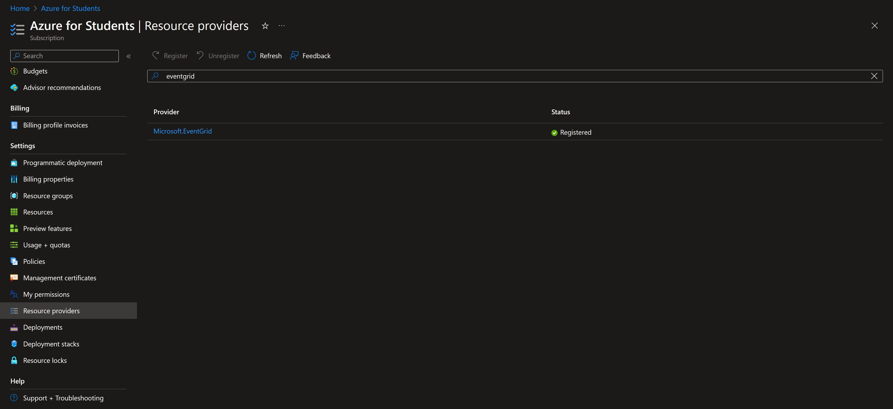
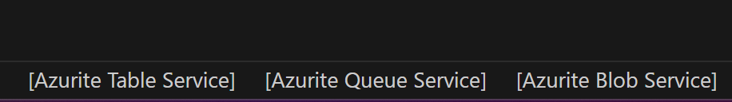
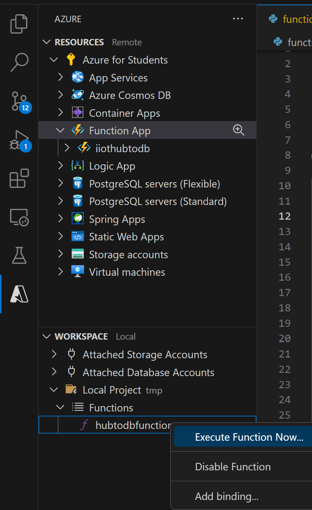
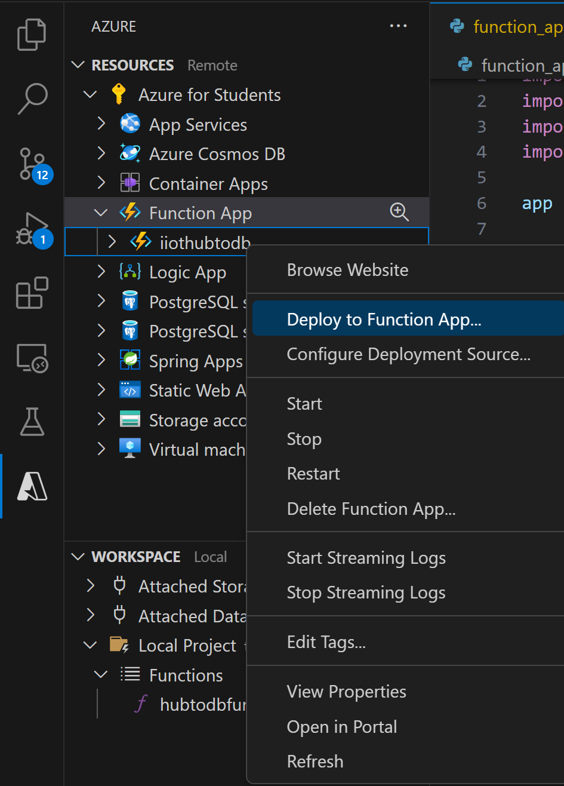
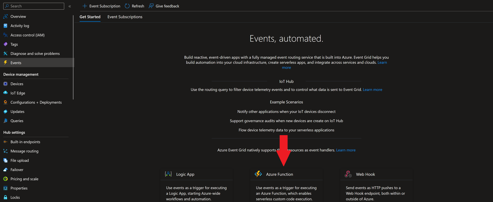

# Storing the data in a database

We have now connected the IoT device to the cloud via the IoT hub and we have created a place where we can store the data.
Now we need to connect these two parts.

## Preparation

Under your Subscription on Azure select Resource providers and search for microsoft.eventgrid, then register it.


## Creating a function app

Create a Function app on azure.

Select:
- Python Version 3.11
- Linux
- Consumption plan
- Rest default

### Creating a function

#### Setup
Open VSCode in a new folder to create a Azure function project.
In VSCode press CTRL+Shift+P to open the command palate. Search and select Azure Functions: Create Function.
Select a folder (most likely the current new folder for the project), select python as a function programming language with model V2.
After selecting a python interpreter use EventGrid trigger for the activation of the function.

A few notes on the project.
- The requirements.txt specifies the packages needed by the function and which are installed in the cloud (you need to specify this separately from what you are using in the conda environment)
- for psycopg2 use "psycopg2-binary" since the normal version does not work with azure functions
- In local.settings.json you can specify environment variables. Use these to avoid putting your credentials in your code!: 
```json
{
  "IsEncrypted": false,
  "Values": {
    "AzureWebJobsStorage": "UseDevelopmentStorage=true",
    "FUNCTIONS_WORKER_RUNTIME": "python",
    "AzureWebJobsFeatureFlags": "EnableWorkerIndexing",
    "DB_USER": "user",
    "DB_PASSWORD": "password"
  }
}
```
- psycopg2 has to be imported in the function definition and not at the top of the file (Azure function specific)

Normally you should always would create a separate user for accessing the database from the azure function with limited rights, but exceptionally you can skip this for this temporary test setup.

#### Coding 

This is an example for getting the message from the event:
```python
@app.event_grid_trigger(arg_name="event")
def hubtodbfunction(event: func.EventGridEvent):

    event_dict = event.get_json()

    message = event_dict["body"] # deserialized message sent from the IoT device
    device_id = event_dict["systemProperties"]["iothub-connection-device-id"] # example of one of the properties attached to the message see for full details: https://learn.microsoft.com/en-us/azure/iot-hub/iot-hub-event-grid#device-telemetry-schema
```

This is an example of how to insert values into the database. You have to adapt the example to fit your values and setup. Keep in mind that depending how you followed the previous step you have to insert multiple rows of data.

```python
username = os.getenv("DB_USER")
password = os.getenv("DB_PASSWORD")
db_connection = "<whateverdatabase>.postgres.database.azure.com:5432/postgres?sslmode=require"

CONNECTION = f"postgres://{username}:{password}@{db_connection}"
import psycopg2 
with psycopg2.connect(CONNECTION) as conn:
	cur = conn.cursor()

	sql_str = "INSERT INTO <table name> ( time, pump1_speed, pump2_speed ) VALUES ( %s, %s, %s )"
	cur.execute(sql_str, (message["time"], message["pump1_speed"], message["pump2_speed"]))
		
	conn.commit()
```

With the examples given and the template created, write a complete function that retrieves the data from the message send by the devices and store all values in the database.

#### Running the function locally

To run the function locally first you have to start all three Azurite services by clicking on them at the bottom of your VSCode window.

[]()

Then you can press F5 to start the local Azure function environment. After the setup is completed you can run the function locally from the azure tab on the left.

[]()

As payload you can adapt the body of this example, just exclude the outer square brackets: https://learn.microsoft.com/en-us/azure/iot-hub/iot-hub-event-grid#device-telemetry-schema

Using pgadmin you can check if the data was stored in the database.

#### Deploying the function in the cloud

After successfully testing the function locally you can deploy the function to your previously created function app.

[]()

Additionally you have to push the environment variable specified in the local.setting.json to the cloud. This can be done by executing "Azure Functions: Upload local settings" from the command palette.

Check on the Azure portal if the function is deployed.

If you click on the Function inside the function app you can see the code and monitor the function, either see past executions or stream the output live.
However the function is not executed yet, because the data from the IoT Hub is not forwarded yet.

### Connecting the Azure function to the IoT Hub

In the IoT Hub you have to create a EventGrid subscription to forward the events to the azure function.



For Event types only select device telemetry and select your just deployed azure function.

If your device is running and sending telemetry messages they should appear in the database with a slight delay.

If not check the different parts of the chain to investigate what causes errors. This can also be helpful if everything works to get familiar with the setup.

# Retrieving the data from the database
From python you can query the table and create a pandas dataframe like this:

```python
username = os.getenv("DB_USER")
password = os.getenv("DB_PASSWORD")
CONNECTION = f"postgres://{username}:{password}@<your database name>.postgres.database.azure.com:5432/postgres?sslmode=require"

with psycopg2.connect(CONNECTION) as conn:
	data_raw = pd.read_sql("SELECT * from <table name>;", conn)
```

By modifying the SQL query you can limit he dataframe for example in time range or columns retrieved.

# Grafana

## installing Grafana in Azure

Search for "Azure Managed Grafana" and create a instance. For pricing plan the standard provides a fee instance for the first 30 days and don't forget to add yourself as an administrator on the permissions tab.
After the resource is created you can find the endpoint to access the dashboard on the overview of the resource. You can login with the same account as used for the Azure portal.

## Adding a datasource

Add your Postgres database as a data source to Grafana. https://grafana.com/docs/grafana/latest/datasources/postgres/
The Database name is most likely just postgres.

## Visualizing data

Create a [dashboard](https://grafana.com/docs/grafana/latest/dashboards/build-dashboards/create-dashboard/) with a [timeseries panel](https://grafana.com/docs/grafana/latest/panels-visualizations/visualizations/time-series/) displaying the values stored in the database.

This is an example query you could use to retrieve the data:
```sql
SELECT time, <other columns>
FROM <table name>
WHERE $__timeFilter(time) 
```

After saving you see a dashboard with the data collected. In the top right you can enable automatic update of the dashboard, if everything is working correctly you can see the new data arriving and being displayed (depending on the setup with 10-60 seconds of delay).